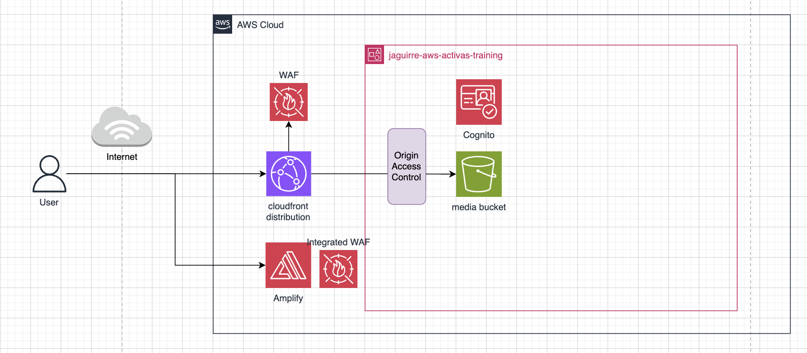

# Activas Training - AWS Infrastructure

AWS infrastructure for [Activas Training](https://github.com/jaredpc/activas-training) — a fitness course platform for pregnant women by Pamela Da Silva.

Managed with Terraform. Targets Argentina-only users (~300 MAU).

---

## Architecture



---

## Services & Cost

| Service | Role | $/month |
|---------|------|--------:|
| AWS Amplify | SSR hosting + CI/CD | ~$17.64 |
| CloudFront | Media CDN + AR geo-restriction | ~$11.50 |
| S3 | Media storage (videos, PDFs) | ~$0.12 |
| Route 53 | DNS for `mamisactivas.com.ar` | $0.50 |
| Amazon Cognito | Auth — register, login, JWT, email verify | $0 (≤50K MAU) |
| DynamoDB | Users, enrollments, progress | $0 (free tier) |
| ACM | Wildcard SSL `*.mamisactivas.com.ar` | $0 |
| **Total** | | **~$30–31** |

---

## Repository structure

```
env/
  dev/
    main.tf       # all resources for the dev environment
docs/
  specs/
    2026-06-05-activas-training-aws.md
```

---

## Environments

| Environment | Branch | Status |
|-------------|--------|--------|
| dev | `main` | active |
| prod | `prod` | not yet |

---

## Usage

```bash
cd env/dev

# first time or after provider version bump
terraform init -upgrade

terraform plan
terraform apply
```

AWS profile required: `jaguirre-aws-activas-training`

---

## Delivery status

| Feature | Status |
|---------|--------|
| S3 media bucket (regional namespace) | ✅ defined |
| CloudFront distribution (AR geo-block) | ✅ defined |
| Terraform state backend (regional namespace) | ✅ configured |
| Amplify + custom domain | ⏳ pending domain registration |
| Amazon Cognito (auth) | ⏳ Plan B |
| DynamoDB | ⏳ Plan B |
